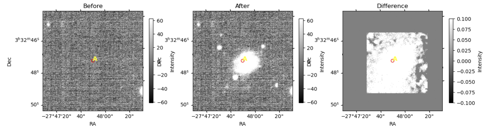
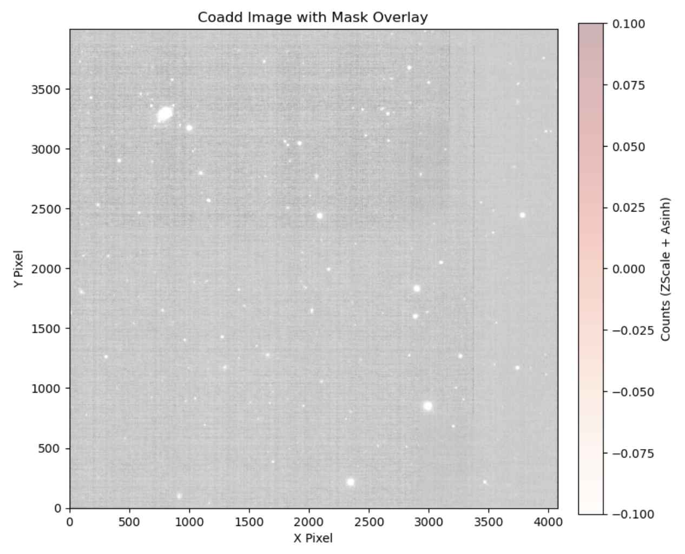

<p align="center" width="160%">
    
</p>

<p float="left">
<a href="LICENSE.txt"> </a>
<a href="https://www.python.org">  </a>
<a href="https://data.lsst.cloud/"> 
</a>
</p>

# SLICE — SeLection Imaging Coadd Engine



**SLICE** is a Python toolkit for building and validating custom image coadds from
[Vera C. Rubin Observatory / LSST](https://www.lsst.org) exposures, with a focus on
diagnosing how observing strategy (depth, band, PSF size, visit selection, ...) affects
the detectability of strong-lensing sources. It wraps the LSST Science Pipelines'
Butler and coaddition/warping tasks with higher-level, notebook-friendly helpers for
visit selection, custom coadd construction, synthetic source injection, and
diagnostic plotting.

If this code contributes to a project that leads to a publication, please acknowledge
our work by citing it — see [Citation](#citation) below.

<hr style="border:.2px solid gray">

## Contents

- [What SLICE does](#what-slice-does)
- [Project layout](#project-layout)
- [Dependencies](#dependencies)
- [Installation](#installation)
- [Usage / examples](#usage--examples)
- [Scientific background](#scientific-background)
- [Citation](#citation)
- [Contact](#contact)

## What SLICE does

SLICE identifies metrics that let us estimate the probability of detecting strong-lensing
(SL) sources as a function of coadd depth (number of combined exposures / exposure time),
sky location, photometric band, and PSF size, among other observing conditions. It is
organized in four layers (see [docs/architecture.md](docs/architecture.md) for a diagram):

1. **Data access** (`slice.utils.butler`) — thin wrappers around the LSST `Butler` for
   remote and local repositories.
2. **Selection helpers** (`slice.py`) — convenience functions to select, load, and
   combine visits and exposures.
3. **Core processing** (`slice.coaddmaker`, `slice.coherentinjection`) — custom coadd
   construction, leave-one-out/rotation validation, and synthetic source injection.
4. **Diagnostics** (`slice.utils.plot`) — plotting utilities for exposures, coadds,
   statistics, and injection results.

`slice.utils.sky`, `slice.utils.fits`, `slice.utils.tools`, and `slice.utils.warp`
provide supporting sky/WCS math, FITS I/O, general helpers, and image warping used
across the layers above.

## Project layout

```
SLICE/
├── py/slice/            # the installable package (import as `import slice`)
│   ├── coaddmaker/       # custom coadd construction, injection-aware pipelines
│   ├── coherentinjection/  # synthetic strong-lensing source injection
│   ├── py/               # visit/exposure selection convenience layer
│   │   ├── exposure/      # load, save, normalize, cut out exposures
│   │   └── visit_selection/  # VisitSL: select/combine visits by sky position
│   └── utils/            # butler, fits, plot, sky, tools, warp helpers
├── examples/            # tutorial notebooks and sample data (see below)
├── docs/                # installation guide, architecture diagram, science background
├── paper/               # draft of a companion scientific article (see below)
└── tests/               # test suite (mirrors py/slice/, see tests/README.md)
```

This follows the conventional `src/`-layout used by most scientific Python packages
(e.g. Astropy-affiliated packages and LSST Science Pipelines packages) — here the
layout directory is named `py/` — keeping the importable code, examples,
documentation, and a future publication cleanly separated.

## Dependencies

Installed automatically via `pip`:

- [NumPy](https://numpy.org)
- [Matplotlib](https://matplotlib.org)
- [Astropy](https://www.astropy.org)
- [pandas](https://pandas.pydata.org)
- [cycler](https://matplotlib.org/cycler/)

> [!IMPORTANT]
> SLICE also requires the **LSST Science Pipelines** (the `lsst.*` modules: `daf.butler`,
> `afw`, `geom`, `pipe.base`, `pipe.tasks`, `drp.tasks`, `skymap`, `source.injection`,
> `utils`). These are **not distributed on PyPI** and must be installed separately, or
> used from an environment that already provides them — see
> [Installation](#installation).

## Installation

Quick start (full walkthrough with troubleshooting notes in
[docs/installation.md](docs/installation.md)):

1. **Get access to the LSST Science Pipelines.** The easiest path is the
   [Rubin Science Platform](https://data.lsst.cloud/) (RSP), which ships a notebook
   environment with the pipelines preinstalled — no local installation needed. To run
   locally instead, follow the official
   [LSST Science Pipelines installation guide](https://pipelines.lsst.io/install/index.html)
   (conda-based) or use the LSST `sciplat-lab` container image.

2. **Clone this repository** into that environment:

   ```bash
   git clone https://github.com/emdajhuda/SLICE.git slice
   cd slice
   ```

3. **Install SLICE and its Python dependencies** in editable mode:

   ```bash
   pip install -e .
   ```

4. **Verify the installation:**

   ```bash
   python -c "import slice; print(slice.__name__, 'OK')"
   ```

5. Open any notebook under [`examples/`](examples/) to get started.

## Usage / examples

The [`examples/`](examples/) directory contains tutorial notebooks grouped by topic:

- **Local Butler setup** — `making_local_butler.ipynb`
- **Custom coadd construction** — `making_CustomCoadd.ipynb`,
  `making_Coadd_from_LocalButler.ipynb`, `loading_LocalCustomCoadd.ipynb`
- **Coadd validation** — `coadd_validation.ipynb`, `rotation_example.ipynb`
- **Synthetic source injection** — `injection_example.ipynb`,
  `injection_put_local_butler.ipynb`
- **Warping** — `warp_example.ipynb`
- **Statistics & diagnostic plots** — `some_statisticPlots.ipynb`
- **End-to-end walkthrough** — `full_example.ipynb`

Sample postage-stamp FITS images used by these notebooks live under
[`examples/stamp/`](examples/stamp/).

## Scientific background

SLICE grew out of exploring PSF size and ellipticity as predictors of strong-lensing
source detectability. A short summary of the method (PSF construction, moments of the
intensity distribution, etc.) lives in [`docs/science/`](docs/science/); a full,
citable scientific description and companion article are planned and will be added
there and in [`paper/`](paper/) as the project matures.

## Citation

If SLICE contributes to a project that leads to a publication, please cite it. Machine-
readable metadata lives in [`CITATION.cff`](CITATION.cff) (GitHub renders a "Cite this
repository" button from it), and the current release can be cited as:

> Gonzalez Morales, A. X., Estrada Roque, A., & Rodriguez Nachez, E. J. *SLICE:
> SeLection Imaging Coadd Engine* (Version 0.1.0) [Computer
> software]. https://github.com/emdajhuda/SLICE

A citable companion article is planned — see [Scientific background](#scientific-background)
and [`docs/science/README.md`](docs/science/README.md) — and will be added to
`CITATION.cff` and here once published.

## Contact

You can contact us via email: gonzalez.alma(at)ugto.mx / arestrada(at)fisica.uaz.edu.mx / ej.rodrigueznachez(at)ugto.mx
