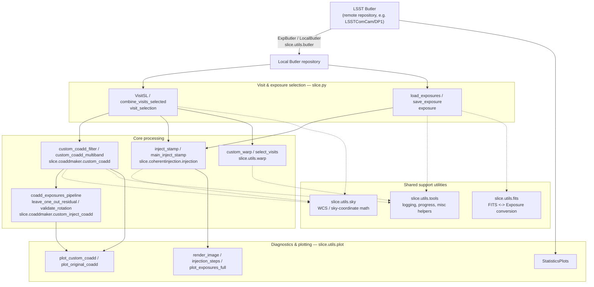

# Architecture & data flow

This diagram shows how the sub-packages under [`py/slice/`](../py/slice/) fit
together, from raw Butler exposures to diagnostic plots. It reflects the actual
import relationships between modules (see the package docstrings for per-function
details).

## Layers

1. **Data access** (`slice.utils.butler`) — `ExpButler` wraps a remote LSST `Butler`;
   `LocalButler` creates and populates a local Butler repository by transferring
   datasets from a remote one, so later steps can run against local data.

2. **Selection helpers** (`slice.py`) — `visit_selection` selects visits by sky
   position/tract-patch and combines them (`VisitSL`); `exposure` loads, saves,
   normalizes, and cuts out exposures.

3. **Core processing**:
   - `slice.coaddmaker` builds custom, filter-aware coadds from a selected set of
     visits (`custom_coadd`), then runs injection-aware coadd pipelines and validation
     (leave-one-out residuals, rotation checks) in `custom_inject_coadd`.
   - `slice.coherentinjection` injects synthetic strong-lensing sources into exposures
     (via `lsst.source.injection`) to test recovery/detectability.
   - `slice.utils.warp` re-projects ("warps") exposures onto a common sky grid ahead of
     coaddition.

4. **Diagnostics** (`slice.utils.plot`) — turns the outputs of the layers above into
   figures: PSF/airmass statistics (`statistics_plot`), coadd comparisons
   (`coadd_plot`), exposure/injection visualizations (`exposure_plot`), and general
   array/Butler plots (`array_plot`, `butler_plot`).

Cutting across all of the above, `slice.utils.sky` (WCS and sky-coordinate math),
`slice.utils.fits` (FITS <-> `Exposure` conversion), and `slice.utils.tools` (logging,
progress bars, misc helpers) provide shared functionality used by several layers.

See [`examples/`](../examples/) for notebooks that walk through this pipeline
end-to-end, and [README.md](../README.md#project-layout) for the repository layout.
